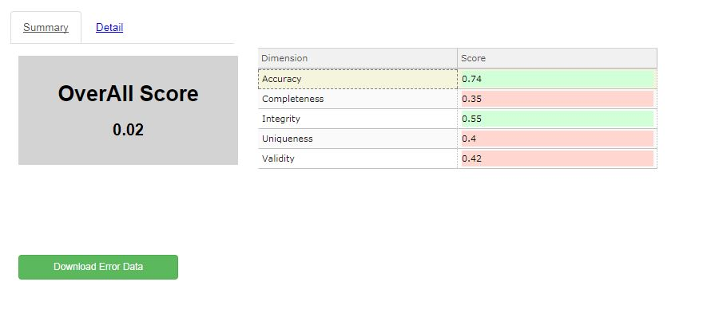
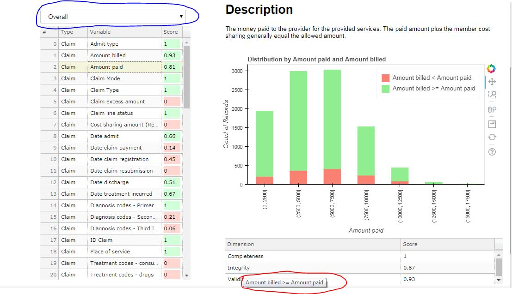

# DataQualityTool
A bokeh based tool for Data Quality Assessment

#### Table of Contents

1. [Introduction](#intro)

2. [User and Beneficiary of the data quality tool](#UserType)

3. [Data Quality Definitions](#Dqdef)

    * [Data Completeness](#completeness)
    * [Data Accuracy](#accuracy)
    * [Data Uniqueness](#Unique)
    * [Data Validity/Conformity](#Valid)
    * [Data Integrity](#Integrity)
 
4. [System Requirements](#Sysreq)

5. [Running on Data Lake](#DataLk)

6. [Preparation Phase](#PrepPhase)

7. [Tool Launch](#Launch)

8. [User Guide](#Uguide)

**Introduction**

DThe data quality tool has been developed to support entities in the journey to enhance the quality of their health data by providing both a baseline and insights into the areas needing improvement. Hence, this minimum viable product can be used for two purposes: 

1. early stage analytics projects to determine how much of the dataset can be used moving forward
2. when putting in place a data quality improvement roadmap to determine the baseline, identify the gaps and the required actions

The quality tool has been built around the minimum health data set, a collection of 80 data elements available in the customer policy, medical claim and, data related to distributors or providers. The minimum health dataset was approved by the Health Data Experts Community, under the coordination of the Global Line health and is the minimum required for every entity to collect and store, regardless of level of maturity, to perform insurance (e.g. pricing, underwriting, product development) and non-insurance related analytics, (e.g. provider profiling, population risk adjustments, Fraud Waste and Aabuse)

However, the tool has been developed to work with any kind of structured data,  - not necessarily part of minimum health dataset, making is reusable for other business lines and functions. 
The tool will check data quality against 5 dimensions: completeness, integrity, accuracy, uniqueness and, validity / conformity and will generate a series of scores:

*  At dataset level across dimensions 
*  At dataset level per dimension 
*  At variable level across dimensions
*  At variable level per dimension

**User and Beneficiary of the data quality tool**

The tool can be used by anyone with either no or basic Python skills, working in the Data Office, Line of Business or any function where the user is expected to work with health data (clinical and non-clinical). To further develop or change the tool, the user would need basic to medium Python skills.

The user will play a key role in the Preparation Phase, where he / she will be expected to map the local data against the minimum health data set and adjust rules based on the business requirements. This person will also be responsible for running the tool and supporting the beneficiary in interpreting the results. 

The beneficiary of the tool is a business owner who is either leading an analytics project and needs to understand the confidence level in the dataset before building the analytics model, or is in charge of maintaining and improving quality of given data elements as part of their data steward role. The beneficiary will support the user in identifying the right data to assess, adjusting the rules and putting in place the actions to improve quality.

**Data Quality Definitions** 

Data Quality in the current tool is assessed on following 5 dimensions - 

* **Data Completeness**

    _Definition:_ It is defined as expected comprehensiveness.
    
    _Scope of data:_ Applicable to all variables (approx. 80) in the minimum health data set, with few exceptions (e.g. beneficiary related data – name, date of birth / death etc.). Exceptions are provided in Excel document.
    
    _Calculation method:_ Calculate fill rates for each variable, the measure of the blank (null or empty string) values or the presence of non-blank values. For mandatory data items, for example – claim ID, policy start date etc., 100% completeness is required. 
    
    _Unit of measure:_ Percentage records. This will be calculate after applying any validity conditions, e.g. if Hospitalization Date is to be present only for in-patients, the numerator will be # in-patients records where Hospitalization Date is populated, and denominator will be total # in-patient records
    
____________________________________________________________________________________________________________
    
* **Data Accuracy**

    _Definition:_ It is defined as the degree to which data correctly reflects in terms of **form** and **content** the real-world object or an event being described.
    
    To check accuracy of form it is required for each variable to have a predefined format. Checking content accuracy is more complex and it can be done by manually checking that the content reflects the real world (impossible with large datasets), benchmarking against other data sources internal or external, or by inferring from other variables in the data set what the variable under discussion could be in the real world.
    
    Hence, the focus will be more on format and less on content accuracy as this would require having additional data sources. 
    
    _Scope of Data:_ Applicable to all variables in the minimum health data set that can have a predefined format to check accuracy against. 
    
    _Calculation method:_ For each variable, determine the compliance with a given format (Yes if compliant / No if not compliant).
    
    Calculate for the entire data set the percentage of compliance
    
    _Unit of measure :_ Percentage records
    
____________________________________________________________________________________________________________
    
* **Data Uniqueness**
    
    _Definition:_ Refers to the fact that a variable flagged as having to be unique is recorded only once, otherwise it is a duplicate.
    
    **YES** example: Member ID is unique as it correspondents to one client only.
    
    **No** example: date of birth is not a unique value as people can be born on the same day. 
    
    _Scope of data:_ Applicable to all variables within the minimum health data set, but relevant only for those variables flagged as unique.
    
    The variables flagged as unique in the minimum health data set are: ID Claim, ID Policy, ID Member, ID distributor and ID provider
    
    _Calculation method:_ Calculate if there are any observations which do not have any differentiation in values 
    
    _Unit of measure:_ Percentage Records
    
____________________________________________________________________________________________________________
    
* **Data Validity/Conformity**

    _Definition:_ A variable passes the validity check if it complies with type, size and format. 
    
    _Scope of data:_ Applicable to all variables (approx. 80) in the minimum health data set that:
    
     *	conform to a given range, in case of numeric, or 
     *	have correct spelling and is discoverable, in case of character variables.
        
    Examples:
    
     1.	Age of insured is between 5 and 95.
     2.	Policy start date is after 1/1/1999.
    
    _Calculation method:_ Comparison of variable values to standard type, format or range.
    
    _Pre-requisite:_ define for each variable whether the check will be done against type / format / range / all and define the associated standards.
    
    _Unit of measure:_ Percentage Records
    
____________________________________________________________________________________________________________
    
* **Data Integrity**

    _Definition:_ It is defined as a measure of variable values corresponding to set of rules, natural or defined by business. For example, date of birth of insured is same as or greater than policy start date or claim registration date is earlier or same as claim payment date.
    
    _Scope of data:_ Applicable to most variables (approx. 80) in the minimum health data set except for standalone variables (e.g. name of policy holder)
    
    _Calculation method:_ Comparison of data format with metadata or data documentation (pre-requisite to have from entity)
    
    _Unit of measure:_ Percentage records
    
____________________________________________________________________________________________________________

**System Requirements**

Tool has been developed on Python, and visualization layer has been built on Bokeh javascripts with its native bindings in Python. In current development version, the tool runs locally on the Desktop/Computer, and takes input from Excel files.

To run the tool, user must have Python 2.7 or above (Current development supports v 3.4), with following python packages

1. Tkinter
2. openpyxl
3. pandas
4. numpy
5. re
6. datetime
7. math
8. bokeh

Please get the latest vesion of all the packages from pip. All of these packages are part of [Anaconda Python installation](https://www.anaconda.com/download/)

**Running on Data Lake**

The tool uses native Python libraries, can be used on any machine including Data Lakes.

In case, the tool needs to be run on the datalake where we don't have UI, all the files and locations can be provided using XML files. A file named _Config.xml_ should be placed in the same directory as the code. This XML file provides the location of Mapping XML, Rule Description and Input Data. If this file is present, tool will not open the dialogue boxes to ask file locations, rather it will automatically read the files.

Bokeh will push the result on a particular port - generally 5006, but it can also push on other ports, and will display on which port it has pushed on the terminal. How the page will be viewed will depend on the server settings, but in general, visualization will be available on _server address:5006_

**Preparation Phase** 

The preparation phase requires creation of two files : 

* _Variable Mapping:_ The mapping of the variable needs to be provided in an excel file. This is the mapping of variable names (without spaces and with underscores) to more readable and meaningful variable names. Though the tool aims to be much flexible and incorporate any variable if mapping is provided, current focus is on developing mapping against the minimum dataset prepared by AGL team. 

This is to ensure that different variable names in different entities can be incorporated, e.g. in an entitiy 'Date of Birth' can be named as 'BirthDate' and 'Policy Number' as 'ContractNumber' the current workbook is formatted in a way that it can take data from multiple tables from a single database, or multiple sheets from an excel workbook.
    
____________________________________________________________________________________________________________

* _Rule Mapping:_ In an excel file, various rules with different weights needs to be provided for the evaluation of data. This rule mapping will be entity specific, as Accuracy, Validity and Integirty rules will be entity dependent, e.g. in UK a real claim amount could be between 1000, 100K in GBP, but in Japan, that will be much higher number in Yen. Similarly, Date and medical coding standards may be different across countries.

    Currently to provide a complete description of a rule, 6 fields needs to be provided:

    * _Rule Id:_ This is just a unique ID to identify the rule. However the sorting of the rules for a particular variable is important as sorting will determine the type of visualization for the rule
    
    * _Dimension:_ This rule is for which of the five dimension explained above
    
    * _Weight:_ Weight of the rule, in terms of importance, in the evaluation of overall data quality across the dimension
    
    * _Depvar:_ Depvar is a variable, on which the current variable and rule is dependent, e.g. Admission Date should be populated(completeness rule), when Admit Type is in-patient. In this case, 'Admit Type' is Depvar. 
    
    Please note that the human readable variable name must be provided. The tool will automatically fetch the mapping from Variable Mapping
    
    * _Condition:_ This condition works on the Dependent variable, and is a way to provide the functionality to read the inequality/equality/list condition. 
    
    In current scope of development, this can take 5 values
    
     1. **>=**: Evaluate rule when Depvar >= the criterion (described below)
     2. **<=**: Evaluate rule when Depvar <= the criterion (described below)
     3. **>**: Evaluate rule when Depvar > the criterion (described below)
     4. **<**: Evaluate rule when Depvar < the criterion (described below)
     5. **in**: Evaluate rule when Depvar in the criterion - A list of values(described below)
        
    * _Criterion:_ This criterion is to compare the Depvar. The comparison function is provided by **Condition** as described above. Depvar is the left hand side of the comparison, and this criterion is right hand side of the comparison equation/inequation. 
    
    Criterion can take following values:
    
     1. **Single Value**: Compare with the single value. In case of list comparison, one element list will be used
     2. **List**: Used for list comparison. List to be provided in parenthesis, and separated by ",". For list of String/Characters, use single quotes around those, e.g. ('A', 'B', 'C')
     3. **this**: Variable on which rule is being evaluated, will be used on right hand side, e.g. if a rule is being evaluated for Amount Paid, and integrity condition is Amount Billed > Amount Paid, then Depvar will be Amount Billed, Condition will be '>' and Criterion will be 'this'
    
    * _C1 :_ This is similar to condition, but this condition will be applied on the variable itself. This will be genetally used in validity and accuracy rules.
    
    C1 can take 3 values:
  
     1. **Format** : To check the format of variables - Number, Character, Date format (in DDMMYYYY or similar format), or a regex. More details of format in Criterion1 below.
     2. **Range** : Currently supports closed form ranges for numbers and Dates. Range values will be provided in Criterion1 variable. Numbered Range to be provided in _[Lower End, Upper End]_ format. Date will be in similar format, but the date should be written in DD/MM/YYYY format only
     3. **Values** : A list of values to be compared against. The list of values will be provided in Criterion 1 Variable. List to be provided in paranthesis, and separated by ",". For list of String/Characters, use single quotes around those, e.g. ('A', 'B', 'C')
        
    * _Criterion1:_ Criterion1 to be provided for the checking the conditions on this variable (as discussed in **C1** above). Criterion1 for Range and Values has already been detailed out. 
    
    For **C1=Format**, criterion1 can take following values - 
    
     1. **Character**: To check if variable is character
     2. **Number**: To check if variable is numeric
     3. **Date Format**: Date format to be provided in common language format e.g. DDMMYYYY or MMDDYYYY etc.
     4. **Regex**: Value will be 'Regex::{Regular Expression to evaluate}'. This will check if a particular field follows a particular type of format described by regex.         
        
        
**Tool Launch** 

Following are the steps to run the tool on the windows PC. For MacOS/Unix, please use the respective terminals.

1. Open command prompt in windows. In case of Unix, use the unix terminal
2. Go to the directory where you have saved 'Tool.py' file. Use cd /D "<\Directory Path\>". Don't use /D in case of Unix
3. Once you are in the directory, use "bokeh serve --show tool.py" to run the tool

Once the tool is launched, a few small dialog boxes will appear to ask the location of Variable Mapping Excel (Current version only supports excel), Type of Data (Please select Excel as of now, as current version only supports excel), and then it will ask for the data file and rule description file. 

In case, you are running tool on a server with SSH connection without UI, you will have to use _Config.xml_, and the dialog boxes will not open. To run the tool on server, use command 

`nohup bokeh serve Tool.py --allow-websocket-origin [Host:port] & `

where [Host:port] is public IP on which all TCP connections are allowed (or IP on which server will listen to connections from particular ports). To access tool, use [Host:port] from any browser on allowed network.

Once all the inputs are provided, the tool will take some 1-2 minutes to calculate at the backend, and then will open the GUI on the browser

**User Guide** 

Once the bokeh server is up and running, tool can be opened in a browser, with allowed Host and Port. On the opened page, two tabs are available as shown in the image:

On the Summary tab, you see the oevrall score and a table with dimension-wise score. On clicking the table, the description of the dimension will come at bottom half pf the page

In the middle of the page, a download button is available to download erroneous data.

On selecting detailed tab, you will see 4 major components:

1. _Dropdown on left top_ : This dropdown provides how the table on left is summarized - by a particular dimension or across the dimension
2. _Table on left bottom (almost entire left)_ : This table is the variable lavel score by the dimensions specified by the dimension as defined in 1. This table works as selection. Select any variable for which you want to see the information on the right.
3. _Chart on the right top_ : The chart tries to show the distribution of the variable with certain rules and criterion. Please note the variable description on the top
4. _Table on bottom right_ : Variable and dimension level scores. On hover, also gives the rule description.

